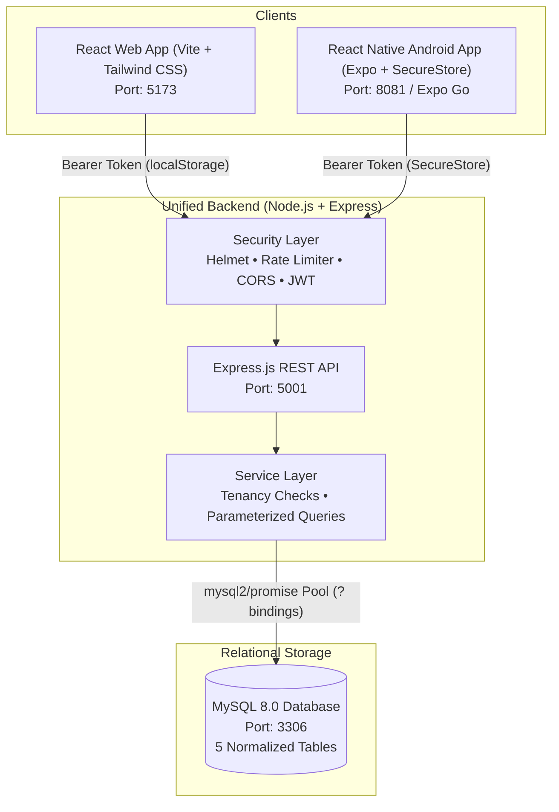
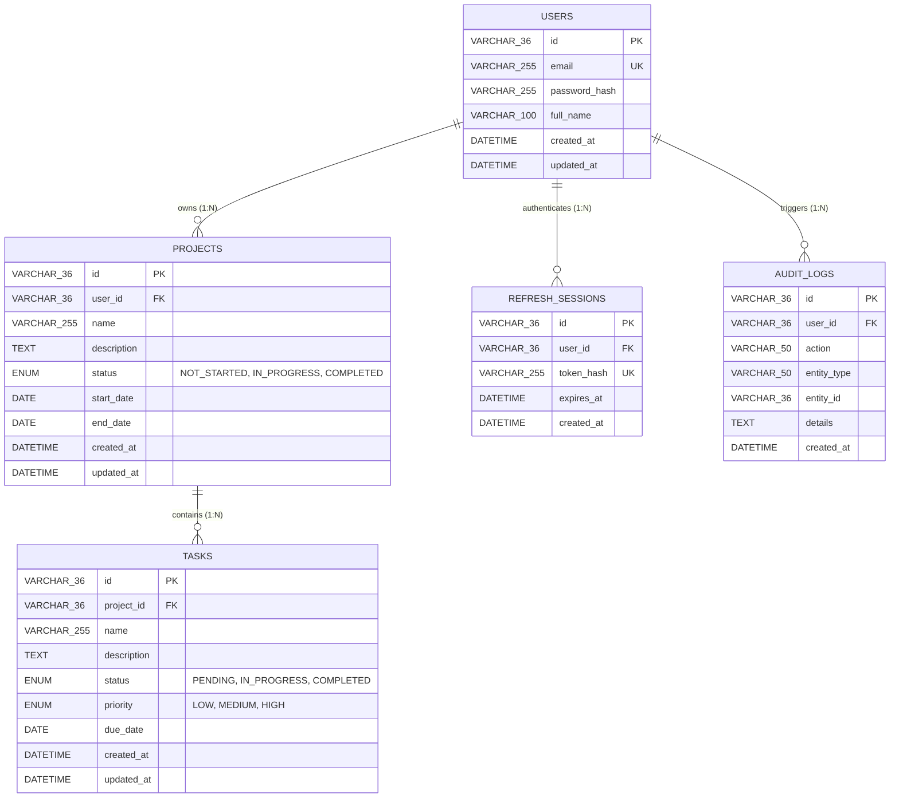

# Project Management System (PMS)
### Unified Web & Android Cross-Platform System

> **A production-grade, multi-tenant Project Management System built with a shared Node.js / Express REST API, a normalized MySQL relational database, a responsive React (Vite) Web application, and a native React Native (Expo) Android mobile application.**
>
> Built entirely with **100% Pure JavaScript (`.js` / `.jsx`)** — zero TypeScript, zero enterprise framework overhead, and cleanly architected so every module, SQL query, and security layer can be easily explained during technical interviews.

---

## Table of Contents
1. [Core Architectural Overview](#core-architectural-overview)
2. [Technology Stack](#technology-stack)
3. [Repository Structure](#repository-structure)
4. [Database Design & Relational Schema](#database-design--relational-schema)
5. [Security & Tenancy (IDOR Protection)](#security--tenancy-idor-protection)
6. [Design System & UI Principles](#design-system--ui-principles)
7. [Environment Variables](#environment-variables)
8. [Local Setup Guide (Step-by-Step)](#local-setup-guide-step-by-step)
9. [Running with Docker Compose](#running-with-docker-compose)
10. [Automated Testing Suite (100% Passing)](#automated-testing-suite-100-passing)
11. [5-Minute Cross-Platform Live Demo Script](#5-minute-cross-platform-live-demo-script)
12. [REST API Documentation Summary](#rest-api-documentation-summary)
13. [Interview & Resume Alignment Guide](#interview--resume-alignment-guide)

---

## Core Architectural Overview

Both the **Web application** and the **Android mobile application** interface with the **exact same REST API backend** and persist data into the **exact same MySQL database**. There are no separate backends or duplicate databases.



---

## Technology Stack

The stack is intentionally selected around core modern JavaScript proficiencies (MERN stack foundation + MySQL relational rigor + Expo React Native):

| Tier | Technologies | Design & Engineering Rationale |
| :--- | :--- | :--- |
| **Backend** | Node.js, Express.js, `mysql2/promise`, JWT, `bcryptjs`, Helmet, CORS, `express-rate-limit` | Pure modern JavaScript (ES Modules). Uses raw parameterized SQL queries (`?`) for transparent SQL injection defense and 0-overhead execution. |
| **Web** | React 18, Vite, Tailwind CSS, React Router v6, Axios, React Hook Form, Recharts, Lucide React | Pure JavaScript/JSX. Warm amber engineering design system (anti-AI-slop), real-time aggregated metrics, responsive data tables, instant status toggling. |
| **Mobile** | React Native, Expo SDK 51, React Navigation (Tabs + Stack), Axios, `expo-secure-store` | Dedicated Android mobile client. Uses hardware-backed encrypted storage for tokens, offline network state banners, and pull-to-refresh sync. |
| **Database** | MySQL 8.0 | Fully normalized 3NF schema, strict foreign keys (`ON DELETE CASCADE`), composite indexes, and relational integrity. |

---

## Repository Structure

```
.
├── backend/                  # Shared Node.js Express REST API
│   ├── src/
│   │   ├── app.js            # Express application configuration & middleware
│   │   ├── server.js         # HTTP server entrypoint
│   │   ├── config/           # MySQL pool connection & auto-table initialization
│   │   ├── controllers/      # auth, project, task, dashboard controllers
│   │   ├── middleware/       # JWT auth, rate limiter, error handler, logger
│   │   ├── routes/           # REST endpoint routers
│   │   ├── services/         # Tenancy-guarded MySQL service queries
│   │   ├── validators/       # Request validation & parameter sanitization
│   │   └── scripts/          # Database table creation and deterministic seeding
│   ├── tests/
│   │   └── api.test.js       # 21 integration tests (Node native test runner)
│   └── package.json
│
├── web/                      # React 18 + Vite Web Application
│   ├── src/
│   │   ├── api/client.js     # Axios client with 401 session expiration handling
│   │   ├── context/          # AuthContext (login, register, logout, persistence)
│   │   ├── components/       # AppShell, Navbar, Sidebar, Modal, Badges, Tables
│   │   ├── pages/            # Dashboard, Projects, ProjectDetail, Tasks, Login, Register
│   │   └── App.jsx           # React Router route tree with ProtectedRoute
│   ├── tailwind.config.js    # Restrained warm amber engineering design tokens
│   └── package.json
│
├── mobile/                   # React Native (Expo) Android Application
│   ├── src/
│   │   ├── api/client.js     # Axios client with SecureStore hardware token interceptors
│   │   ├── context/          # AuthContext with SecureStore token restoration
│   │   ├── navigation/       # AppNavigator (Tabs + Native Stack)
│   │   ├── screens/          # Dashboard, Projects, Tasks, Details, Create, Profile
│   │   ├── components/       # OfflineBanner, MetricCard, TaskRow, StatusBadge
│   │   └── theme/            # Shared color and spacing tokens
│   ├── app.json              # Expo configuration (Android permissions, scheme)
│   └── package.json
│
├── docs/                     # Architectural and design documentation
│   ├── architecture.md       # High-level architecture and security flow
│   ├── database.md           # ER diagram, SQL indexes, and tenancy design
│   ├── api.md                # Comprehensive endpoint reference
│   └── design-system.md      # Typography, color tokens, and anti-slop rules
│
├── docker-compose.yml        # One-command orchestration for MySQL + Backend
└── README.md                 # Complete system documentation
```

---

## Database Design & Relational Schema

The database utilizes **MySQL 8.0** with strict InnoDB foreign key constraints, normalized tables, and composite indexes designed for tenant isolation.

### Entity Relationship Diagram (ERD)



### Relational Integrity & Performance Indexes
- **`ON DELETE CASCADE`**: When a project is deleted, MySQL automatically cascades and removes all associated tasks, maintaining referential integrity without orphan records.
- **Tenant Indexes**:
  - `idx_projects_user_status (user_id, status)`: Fast filtered project listings.
  - `idx_tasks_project_status (project_id, status)`: Sub-millisecond task aggregation per project.
  - `idx_tasks_due_date (due_date)`: Fast upcoming and overdue queries for the dashboard.
- **Parameterized SQL Bindings**: Every query in the service layer uses positional `?` placeholders with an array of values (`pool.execute(sql, [userId, ...])`), guaranteeing total immunity to SQL injection.

---

## Security & Tenancy (IDOR Protection)

Insecure Direct Object References (IDOR) are prevented through strict tenancy boundaries enforced at the SQL layer:

1. **Project Tenancy**:
   ```sql
   SELECT * FROM projects WHERE id = ? AND user_id = ?
   ```
2. **Task Tenancy (Relational Join Guard)**:
   ```sql
   SELECT t.*, p.name AS project_name
   FROM tasks t
   INNER JOIN projects p ON p.id = t.project_id
   WHERE t.id = ? AND p.user_id = ?
   ```
3. **Anti-Enumeration (404 instead of 403)**:
   If User A attempts to view, update, or delete a resource owned by User B, the system returns `404 Not Found` with the message `"Project not found or access denied."`. This prevents attackers from guessing valid record IDs.
4. **Session Expiration**:
   When an access token expires or is tampered with, the API responds with `401 Unauthorized` and `"Your session expired. Please sign in again."`. Both Web and Mobile clients intercept this response:
   - **Web**: Clears `localStorage`, writes flash banner to `sessionStorage`, and redirects to `/login?expired=true`.
   - **Mobile**: Clears `SecureStore` credentials, triggers the auth context state handler, and presents an in-app session expired banner.

---

## Design System & UI Principles

Following the **Anti-AI-Slop** standard, the user interface rejects generic purple gradients, bubbly floating cards, and empty white space in favor of an **engineer-grade, high-density editorial aesthetic**:

- **Color Palette**:
  - Primary Accent: Deep Rust / Burnt Amber (`#C2410C` / `amber-700`)
  - Accent Dark: Rich Ochre (`#9A3412` / `amber-800`)
  - Warm Canvas Background: Ivory Tint (`#FAF9F5`)
  - Surface Card Background: Pure Crisp White (`#FFFFFF`)
  - Structural Borders: Precision 1px Cool Gray (`#E4E4E7` / `zinc-200`)
  - Dark Mode / Slate Elements: Deep Charcoal (`#18181B` / `zinc-900`)
- **Typography**:
  - Body & UI: `IBM Plex Sans` (engineered, highly legible)
  - Metrics & Status Badges: `IBM Plex Mono` (monospace data density)
- **Component Polish**:
  - No bloated 6-line text wrapping.
  - Subtle interactive micro-transitions (`transition: all 150ms ease`).
  - Native Recharts charts with custom tooltip styling matching the design tokens.

---

## Environment Variables

### Root / Backend (`backend/.env`)
```env
PORT=5001
NODE_ENV=development
DB_HOST=localhost
DB_PORT=3306
DB_USER=root
DB_PASSWORD=
DB_NAME=project_management_db
JWT_SECRET=pms-super-secure-production-ready-jwt-secret-key-2026
JWT_EXPIRES_IN=15m
REFRESH_EXPIRES_DAYS=7
CORS_ORIGIN=http://localhost:5173,http://127.0.0.1:5173,http://localhost:3000
```

### Web Application (`web/.env`)
```env
VITE_API_URL=http://localhost:5001/api
```

### Mobile Application (`mobile/.env`)
```env
# For Android Emulator: 10.0.2.2 automatically routes to the host machine's localhost
EXPO_PUBLIC_API_URL=http://10.0.2.2:5001/api

# For Physical Android device over Wi-Fi, change to your machine LAN IP:
# EXPO_PUBLIC_API_URL=http://192.168.1.50:5001/api
```

---

## Local Setup Guide (Step-by-Step)

### Prerequisites
- **Node.js**: v18.0.0 or higher
- **MySQL**: v8.0 running locally on port 3306 (or via Docker)
- **Expo CLI**: Included via `npx expo`

---

### Step 1: Start MySQL Database
Ensure MySQL is running on your machine:
```bash
# macOS (Homebrew)
brew services start mysql

# Or check status
mysqladmin ping -u root
```

---

### Step 2: Configure & Start Backend
From the project root:
```bash
cd backend

# 1. Install dependencies
npm install

# 2. Initialize database schema (creates users, projects, tasks, sessions, audit_logs)
npm run db:init

# 3. Seed deterministic demo data
npm run db:seed

# 4. Start backend server
npm run dev
```
*The backend API will start on `http://localhost:5001`.*

**Pre-seeded Demo Accounts:**
- **Primary Account**: `alex.dev@example.com` / `Password123!` (4 projects, 15 tasks)
- **Secondary Account (IDOR verification)**: `jordan.qa@example.com` / `Password123!` (1 private project, 2 tasks)

---

### Step 3: Start Web Application
In a new terminal window:
```bash
cd web

# 1. Install dependencies
npm install

# 2. Start Vite dev server
npm run dev
```
*The web application will open on `http://localhost:5173`.*

---

### Step 4: Start Android Mobile Application
In a new terminal window:
```bash
cd mobile

# 1. Install dependencies
npm install

# 2. Start Expo for Android
npx expo start --android
```
*Press `a` in the terminal to launch the Android emulator, or scan the QR code using Expo Go on a physical Android device.*

---

## Running with Docker Compose

For evaluators who prefer one command to start the entire backend and database:
```bash
# Start MySQL container + Backend container
docker compose up --build

# In a separate terminal, launch the web client
cd web && npm run dev
```

---

## Automated Testing Suite (100% Passing)

The backend features a comprehensive automated integration test suite written with Node.js's native test runner (`node:test` and `node:assert/strict`) using `supertest`.

To execute the test suite:
```bash
cd backend
npm test
```

### Test Coverage Highlights (21 Integration Tests)
- **Authentication**:
  - `POST /api/auth/register` prevents duplicate emails (409 Conflict).
  - `POST /api/auth/login` validates password hash and issues JWT.
  - `GET /api/auth/me` returns user profile and strips `passwordHash`.
  - Token expiration validation returns `"Your session expired. Please sign in again."`.
- **Tenancy & IDOR Isolation**:
  - User A cannot view User B's project (404 Not Found).
  - User A cannot update User B's project (404 Not Found).
  - User A cannot delete User B's project (404 Not Found).
  - User A cannot view User B's task (404 Not Found).
  - User A cannot modify User B's task status (404 Not Found).
  - User A cannot inject a task into User B's project (404 Not Found).
- **CRUD Operations**:
  - Full project lifecycle with start/end date validation (`endDate >= startDate`).
  - Full task lifecycle with priority and status transitions.
  - Cascade deletion verification: Deleting project removes tasks in database.
- **Dashboard Aggregations**:
  - Real-time SQL aggregations for project status counts, task status breakdown, priority distribution, and completion percentage.

---

## 5-Minute Cross-Platform Live Demo Script

Use this script during technical interviews to showcase full-stack proficiency:

| Time | Action | What to Explain to the Interviewer |
| :--- | :--- | :--- |
| **0:00 - 1:00** | **Database & Architecture** | Open `docs/database.md`. Explain: *"Both Web and Android clients share a single Node.js Express backend and MySQL database. We enforce strict 3NF normalization, foreign key cascading, and composite indexes for tenant queries."* |
| **1:00 - 2:00** | **Web Application Walkthrough** | Open `http://localhost:5173`. Click the **Demo Account** button to autofill `alex.dev@example.com`. Showcase: 1) Executive dashboard with Recharts workload distribution; 2) Filter projects by status; 3) Quick-add a new task; 4) Toggle task completion directly from the table checkbox. |
| **2:00 - 3:00** | **Android Mobile Walkthrough** | Open Android emulator. Sign in with `alex.dev@example.com`. Point out: 1) Credentials safely stored in Android's hardware keystore via `expo-secure-store`; 2) Pull-to-refresh syncs with the MySQL backend; 3) Add a task on mobile and immediately refresh the web browser to demonstrate live cross-platform sync. |
| **3:00 - 4:00** | **IDOR & Security Demonstration** | Open Postman / curl. Log in as Jordan (`jordan.qa@example.com`). Attempt to fetch Alex's project ID: `GET /api/projects/:alexProjectId`. Show that the API responds with `404 Not Found`. Explain: *"We use relational JOIN guards and intentionally return 404 instead of 403 to prevent resource enumeration."* |
| **4:00 - 5:00** | **Session Expiry & Token Rotation** | Send an expired or corrupted bearer token. Point out the exact error message: `"Your session expired. Please sign in again."`. Show how both Web (sessionStorage + query param redirect) and Mobile (SecureStore wipe + state reset) handle session expiration gracefully. |

---

## REST API Documentation Summary

Base URL: `http://localhost:5001/api`

| Method | Endpoint | Auth | Description |
| :--- | :--- | :---: | :--- |
| `POST` | `/auth/register` | No | Register a new user account with hashed password |
| `POST` | `/auth/login` | No | Authenticate user and receive JWT access & refresh tokens |
| `POST` | `/auth/refresh` | No | Rotate refresh token and receive a new access token |
| `GET` | `/auth/me` | Yes | Get authenticated user profile (password excluded) |
| `POST` | `/auth/logout` | Yes | Revoke refresh session and clear tokens |
| `GET` | `/projects` | Yes | List tenant's projects with status filter & pagination |
| `POST` | `/projects` | Yes | Create a new project (validated start & end dates) |
| `GET` | `/projects/:id` | Yes | Get project detail with task deliverables breakdown |
| `PUT` | `/projects/:id` | Yes | Update project fields (tenancy enforced) |
| `DELETE` | `/projects/:id` | Yes | Delete project (cascades to all associated tasks) |
| `GET` | `/tasks` | Yes | List tasks with filters (project, status, priority, search) |
| `POST` | `/tasks` | Yes | Create a new task under a project owned by user |
| `GET` | `/tasks/:id` | Yes | Get task detail (relational JOIN tenancy guard) |
| `PUT` | `/tasks/:id` | Yes | Update task status, priority, due date, description |
| `DELETE` | `/tasks/:id` | Yes | Delete task (ownership verified) |
| `GET` | `/dashboard` | Yes | Aggregated metrics, priority distribution, urgent tasks |

*For complete request/response schemas, see [`docs/api.md`](docs/api.md).*

---

## Interview & Resume Alignment Guide

When presenting this project to interviewers, highlight how it maps directly to real-world software engineering competencies:

1. **MERN Foundation Transitioned to Relational Rigor**:
   - *"While I am experienced with Node.js and MongoDB, I deliberately engineered this system with MySQL to demonstrate relational modeling, foreign keys, cascading constraints, and parameterized queries."*
2. **True Full-Stack Discipline**:
   - *"Rather than building separate toy apps, I designed one shared REST API backend that services both a responsive React web application and an Android mobile application with hardware token persistence."*
3. **Security by Design**:
   - *"I implemented defense-in-depth: Helmet for secure HTTP headers, express-rate-limit against brute force, bcrypt password hashing, and strict SQL tenancy checks to eliminate IDOR vulnerabilities."*
4. **Developer Experience & Maintainability**:
   - *"The codebase is 100% pure JavaScript using modern ES modules. Every function is clean, self-contained, and backed by automated integration tests, ensuring immediate readability and explainability."*

---

## License
MIT License. Built for full-stack engineering assessment and technical evaluation.
