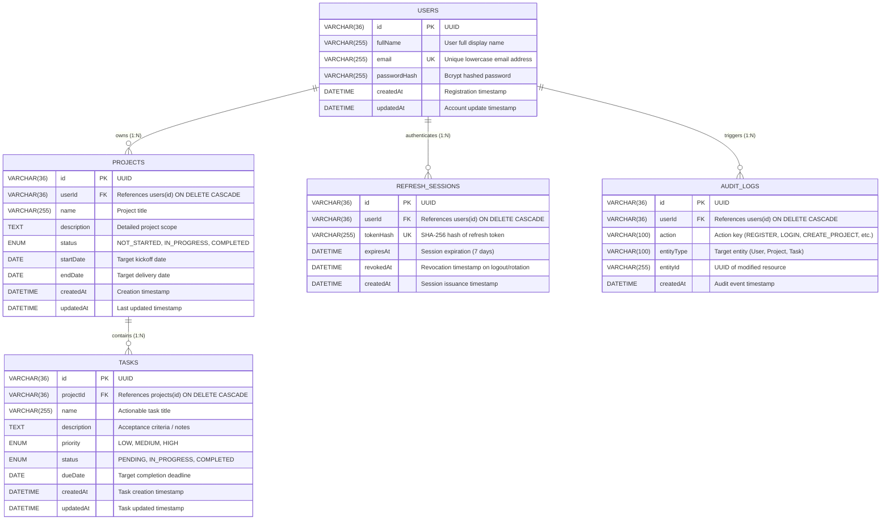

# DATABASE SPECIFICATION & ENTITY RELATIONSHIP (ER) DIAGRAM
## Relational Design for Project Management System (MySQL)

---

### 1. Entity-Relationship Diagram (ERD)



---

### 2. Relational Integrity & Foreign Key Constraints

1. **User -> Project Cascade**:
   - `CONSTRAINT fk_projects_user FOREIGN KEY (userId) REFERENCES users (id) ON DELETE CASCADE`
   - Guarantees referential integrity: Deleting a user account cleans up all associated projects.

2. **Project -> Task Cascade**:
   - `CONSTRAINT fk_tasks_project FOREIGN KEY (projectId) REFERENCES projects (id) ON DELETE CASCADE`
   - When a project is deleted, all child tasks are automatically deleted. No orphaned task records can exist.

3. **User -> RefreshSession & AuditLog Cascade**:
   - Cascading deletions prevent dangling authentication sessions or orphan logs.

---

### 3. Indexing Strategy & Query Optimization

| Table | Index Name | Columns Indexed | Rationale |
|---|---|---|---|
| `users` | `PRIMARY` | `id` | Clustered primary key lookup. |
| `users` | `email` (UNIQUE) | `email` | Fast authentication queries and unique constraint enforcement. |
| `projects` | `idx_projects_user` | `userId` | Strict tenancy queries (`WHERE userId = ?`). |
| `projects` | `idx_projects_status`| `status` | Filter by status (`NOT_STARTED`, `IN_PROGRESS`, `COMPLETED`). |
| `projects` | `idx_projects_name` | `name` | Search bar query optimization. |
| `tasks` | `idx_tasks_project` | `projectId` | Parent-child join queries (`WHERE projectId = ?`). |
| `tasks` | `idx_tasks_status` | `status` | Kanban & status filtering (`PENDING`, `IN_PROGRESS`, `COMPLETED`). |
| `tasks` | `idx_tasks_priority`| `priority` | Priority sorting and filtering (`HIGH`, `MEDIUM`, `LOW`). |
| `tasks` | `idx_tasks_due_date`| `dueDate` | Dashboard due date & overdue calculations. |
| `refresh_sessions` | `idx_sessions_user` | `userId` | User session revocation on logout. |
| `audit_logs` | `idx_audit_user` | `userId` | User activity feeds. |
| `audit_logs` | `idx_audit_entity` | `entityType, entityId` | Entity-specific audit history lookup. |

---

### 4. Tenancy & IDOR Prevention Rules in SQL

Every SQL query in the service layer enforces ownership via parameterized inputs:
```sql
-- Safe Project Fetch
SELECT * FROM projects WHERE id = ? AND userId = ?;

-- Safe Task Fetch (Joins through parent Project)
SELECT t.* FROM tasks t
JOIN projects p ON t.projectId = p.id
WHERE t.id = ? AND p.userId = ?;
```
If 0 rows are returned, the application throws a 404/403 response immediately, preventing any unauthorized visibility or modification.
